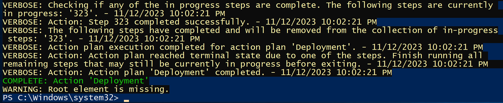

# Deploy-ASDK-ADFS

This script can be used to deploy a single or multiple Azure Stack Hub SDK environments in Azure. It was built to be used with the Azure Stack Hub Operator Labs https://github.com/RichShillingtonMSFT/Azure-Stack-Hub-Operator-Labs-ADFS.

By default, this script will deploy a Standard_E16s_v3 virtual machine as well as all the necessary components.
You can select from different ASDK versions when starting the deployment.

The versions you can choose from are 2301, 2206, and 2108.

The script will also deploy 3 virtual machines that will run in Hyper-V on the host Virtual Machine.

* AD-01 - Domain Controller for Contoso.local domain.
* ADCS-01 - Certificate Services to issue deployment certificates.
* ADFS-01 - A domain joined VM to be used for ADFS Integration.

When the deployment begins, these virtual machines will be removed to prevent ASDK install failures. You can use the FinalizeServers.ps1 script to restore them.

## Instructions for use

* Clone or download the repo
* Open a PowerShell window and switch to the directory containing Invoke-ASDKADFSDeployment.ps1
* Use this command to begin the install.

```
    .\Invoke-ASDKADFSDeployment.ps1 -LabResourceGroupName 'ASDK-ADFS-RG' `
        -DNSForwarder '8.8.8.8' -TimeServer '168.61.215.74' `
        -VirtualMachineAdminUserName 'VMAdmin' `
        -ASDKVersion '2301' -VirtualMachineNamePrefix 'asdk' `
        -VirtualMachineCount '1' -DNSPrefixForPublicIP 'asdk'
```

You can specify your own Resource Group Name, Virtual Machine Admin UserName, DNS Forwarder, Time Server, Virtual Machine Name Prefix, DNS Prefix for the Public IP, ASDK Version & count of ASDKs to deploy.

The script will prompt you to select the Azure Environment for deployment, the subscription to use for deployment, the Azure Region/Location & the password to use for the deployed environment.

The complete deployment will take about 10-12 hours. When the deployment is complete, you will see the following in the PowerShell window on the ASDK.



## Post deployment tasks

When the deployment is complete, you can run .\FinalizeServers.ps1 located on the root of C:\ to restore the contoso.local virtual machines.

Or you could use Restore-ASDKDomainVMs.ps1 to perform the VM restore on all ASDKs in the Resource Group.